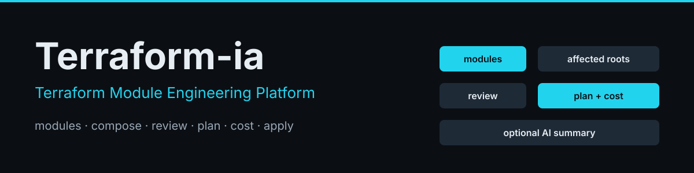
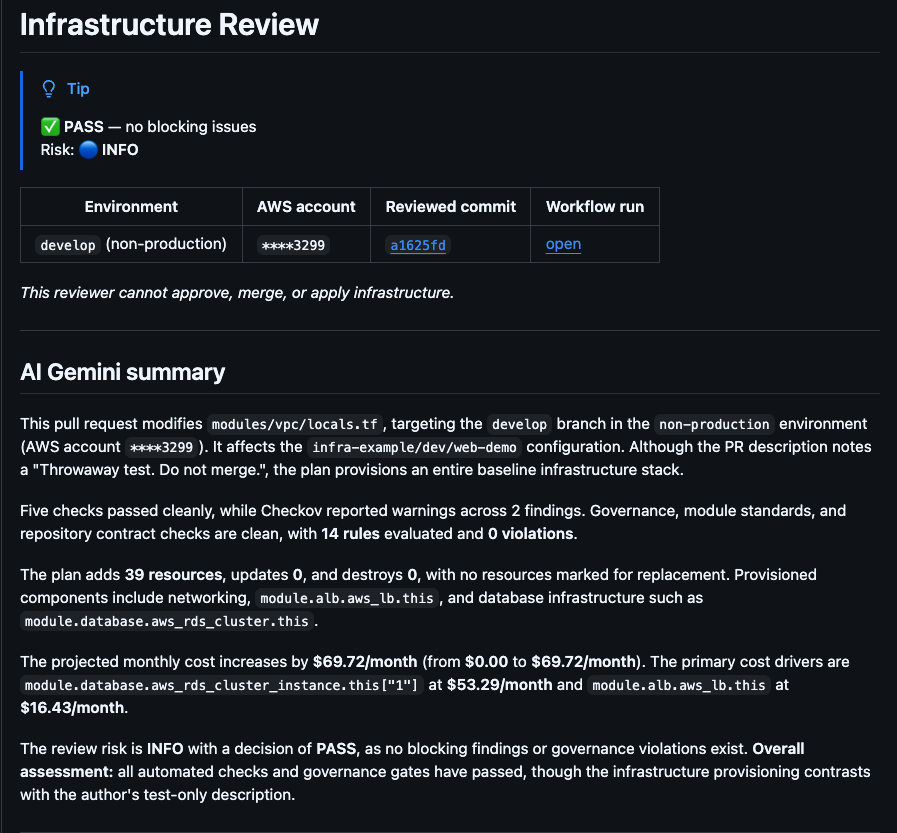
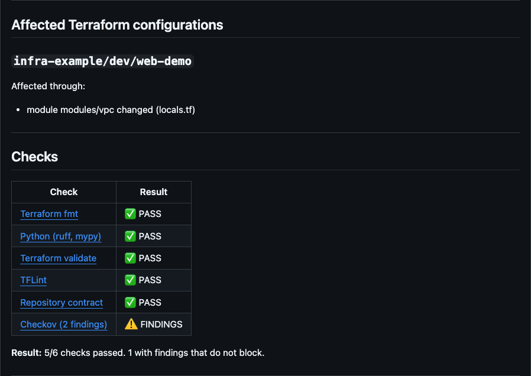
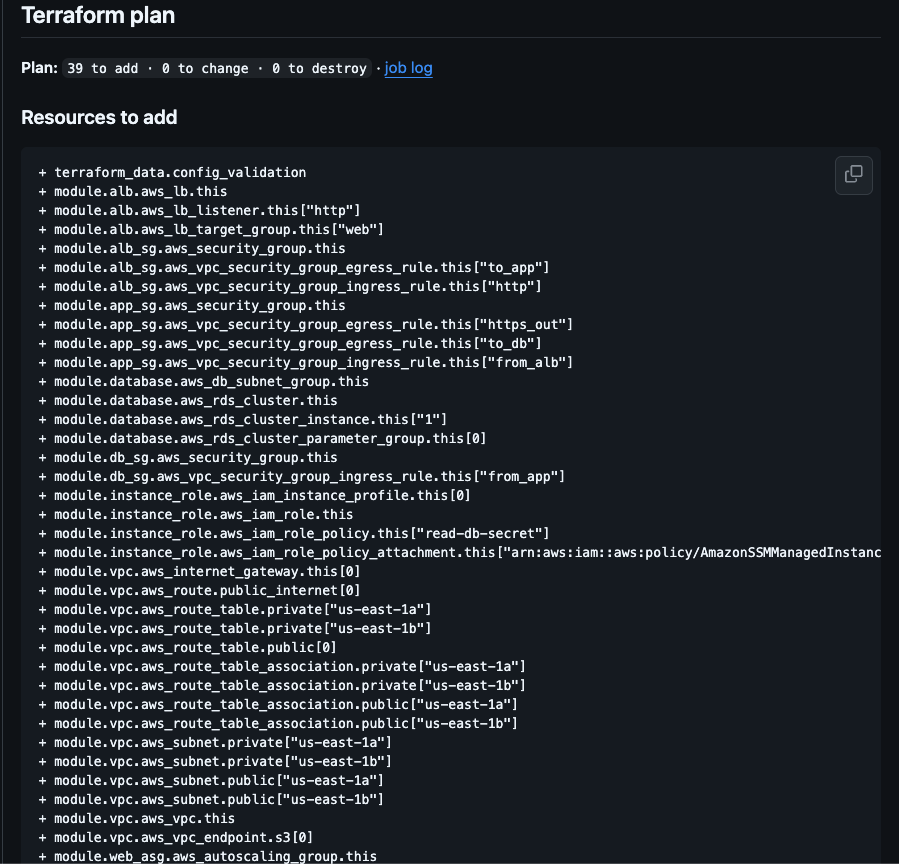
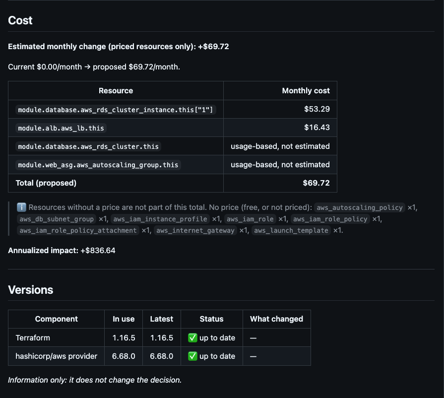
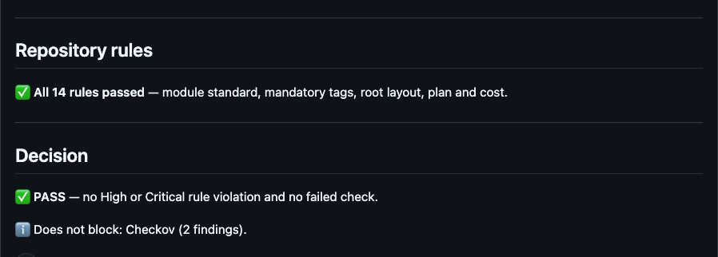

<div align="center">



<br>


English · [Español](README.es.md)

**[Setup](docs/install.md)** · **[How it works](docs/architecture.md)** · **[What each file is](docs/files.md)** · **[The checks](docs/checks.md)** · **[Module standard](docs/module-standard.md)**

</div>

## What it is

A Terraform platform: a library of reusable AWS modules, the root configurations built from them, and a pull-request pipeline that

- finds **which root configurations a change affects** (including the ones that only use a changed shared module) and runs Terraform only for those,
- plans, estimates cost and checks the change against the repository's own contract,
- **decides pass or fail with code**, and optionally has an AI write a plain-language summary of the evidence,
- deploys only when you ask (a manual run; merging never touches AWS), with **`develop` and `main` mapped to separate AWS accounts**.

No folder names are assumed: it works the same for `infra/web`, `terraform/networking` or `environments/dev`.


## Quick start

**Install** (details in [Setup](docs/install.md)):

1. Use this repository (fork or clone). `main` is production; create `develop`.
2. In [`common.yaml`](common.yaml) set the `project` and each environment: its `branch`, its AWS `account` and its `roots`.
3. Create the state bucket once per account and region: `<project>-tfstate-<account id>-<region>`.
4. Add the secrets: `AWS_ACCESS_KEY_ID_DEVELOP` / `AWS_SECRET_ACCESS_KEY_DEVELOP`, the `..._MAIN` pair, and `AWS_REGION` (`gh secret set <NAME>`).

**Use**:

1. Change a module or an `inputs.yaml` on a branch and open a pull request into `develop`. The comment shows the verdict, the plan and the cost.
2. Merge it. **Nothing is deployed.**
3. Deploy by hand, plan first:
   ```bash
   gh workflow run terraform.yml --ref develop -f root=infra-example/dev/web-demo -f mode=plan
   gh workflow run terraform.yml --ref develop -f root=infra-example/dev/web-demo -f mode=apply
   ```
   Or in GitHub: *Actions* → **terraform** → **Run workflow**, choosing the branch, the root and `mode` (see [install](docs/install.md#5-open-a-pr)).
4. Production: a pull request from `develop` into `main`, then the same two commands with `--ref main` and the prod root.

To go further: [add an environment](infra-example/README.md#adding-an-environment) · [write a module](docs/module-standard.md) · [add a rule](docs/checks.md).

## Highlights

| | |
| --- | --- |
| **Affected-root discovery** | A module-call graph built from local `source` paths. Edited roots, edited modules (transitively) and edited shared files are mapped to roots. Docs trigger nothing. |
| **Branch → account** | `develop` and `main` use different AWS keys. Before `init`, the pipeline compares the keys' account with the one `terraform.environments` names for the branch and stops on a mismatch. |
| **Deterministic verdict** | `REQUEST_CHANGES` on any HIGH or CRITICAL finding or failed check; otherwise `PASS`. The AI never takes part. |
| **Reviewer** | Rules (module boundaries, mandatory tags, plan and cost against the standards) on top of `terraform`, TFLint, Checkov and Infracost. |
| **AI summary** | One text, schema-validated and grounded: every resource, file and price it mentions is checked against the evidence. Off by default; a failing model never changes the result. |
| **Modules** | Reusable AWS modules, each with a README and typed, validated inputs. |

## What the review looks like

Every pull request gets one comment like this, updated on each push. The decision comes from code; the Gemini summary only explains it.



<details>
<summary><b>See the rest of the comment</b>: roots, checks, plan, cost, versions, rules and decision</summary>

<br>

**Affected roots and checks.** Each check links to its job log.



**Terraform plan.** Read-only, with a link to the job that produced it.



**Cost and versions.** The Infracost estimate and the Terraform and provider versions in use.



**Repository rules and decision.** Whether the rules passed, and what does and does not block.



</details>

## Modules

Each module has its own README with usage, resources, inputs, outputs, lifecycle and cost. The [module standard](docs/module-standard.md) is the contract they follow.

| Module | What it gives you |
| --- | --- |
| [`vpc`](modules/vpc/README.md) | VPC with a private tier, an optional public tier, per-AZ route tables, opt-in NAT and a free S3 gateway endpoint. |
| [`security-group`](modules/security-group/README.md) | Least-privilege security group, one resource per rule; no rules and no egress by default. |
| [`iam`](modules/iam/README.md) | IAM role with trust policy, managed and inline policies and an optional instance profile. |
| [`s3`](modules/s3/README.md) | Private, encrypted, versioned bucket with a TLS-only policy and optional lifecycle rules. |
| [`aurora`](modules/aurora/README.md) | Aurora cluster, PostgreSQL or MySQL (the `engine` input selects it). |
| [`lambda`](modules/lambda/README.md) | Lambda function with its log group, optional VPC attachment, dead-letter queue and tracing. |
| [`eventbridge`](modules/eventbridge/README.md) | EventBridge rules and targets with retries, dead-letter queue and invoke permissions. |
| [`api-gateway`](modules/api-gateway/README.md) | HTTP API with Lambda and private (VPC Link) integrations, access logs and throttling. |
| [`acm`](modules/acm/README.md) | Public ACM certificate validated by DNS, with its Route 53 validation records. |
| [`route53/zone`](modules/route53/zone/README.md) | Route 53 hosted zone, public or private, protected from deletion with records. |
| [`route53/records`](modules/route53/records/README.md) | Route 53 records in an existing zone: standard records and aliases. |
| [`elb/alb`](modules/elb/alb/README.md) | Application Load Balancer: HTTP/HTTPS listeners, rules, redirects, optional WAF and access logs. |
| [`elb/nlb`](modules/elb/nlb/README.md) | Network Load Balancer with target groups and listeners. |
| [`ec2/launch-template`](modules/ec2/launch-template/README.md) | Hardened launch template (IMDSv2, encrypted root volume), shared by `ec2/instances` and `ec2/asg`. |
| [`ec2/instances`](modules/ec2/instances/README.md) | Standalone EC2 instances from a launch template, private by default. |
| [`ec2/asg`](modules/ec2/asg/README.md) | Auto Scaling Group over a launch template, with rolling refresh, tag propagation and scaling policies. |
| [`eks/cluster`](modules/eks/cluster/README.md) | EKS control plane: private endpoint by default, access entries, logging, optional secrets encryption and IRSA. |
| [`eks/node-group`](modules/eks/node-group/README.md) | EKS managed node groups, expressed as intent. |
| [`eks/addons`](modules/eks/addons/README.md) | EKS managed add-ons, installed only when listed. |

## Contributing, security and license

How to contribute: [CONTRIBUTING.md](CONTRIBUTING.md). How to report a vulnerability (privately): [SECURITY.md](SECURITY.md). License: [MIT](LICENSE).

## Stack

&nbsp;&nbsp;&nbsp;&nbsp;&nbsp;&nbsp;&nbsp;

To run the pipeline on your own repository: [Setup](docs/install.md).

> [!NOTE]
> Plans, checks and the PR comment have run on GitHub. `terraform apply` (manual) has not been validated end to end yet.

<details>
<summary><b>Repository layout</b></summary>

```text
modules/              Reusable AWS modules (README each)
infra-example/        Example roots: dev/web-demo and prod/web-demo
tests/                Every test, run only by the pipeline: tests/reviewer (pytest) and tests/terraform (terraform test)
tools/                The reviewer: ci/ (one file per workflow step) · lib/ · terraform/ · rules/ · review/ · infracost/ · aws/ · ai/
.github/workflows/    pull-request.yml (checks, plans, comment) · terraform.yml (plan / apply)
common.yaml           project, state settings, AI switch, and the environments (branch, AWS account, roots)
docs/                 Setup, architecture, file map, the checks, module standard
.claude/              terraform-ia-engineer agent (proposes, never runs commands) and the skills new-module, new-rule and new-root
CLAUDE.md             the conventions Claude Code reads in every session
```

</details>
