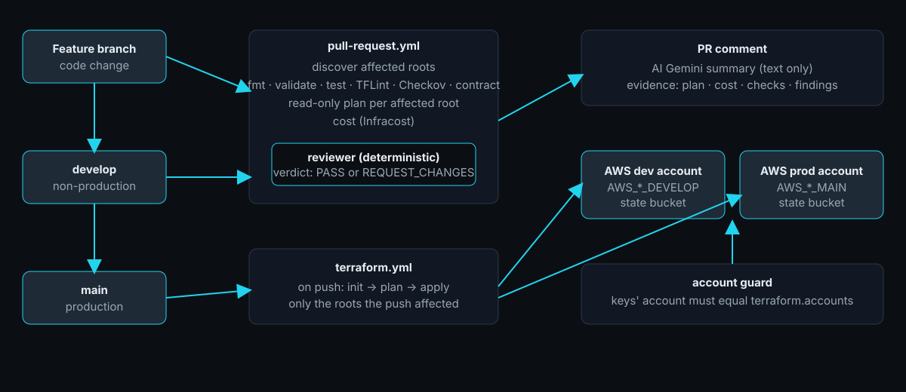

# Cómo funciona

[← README](../../README.es.md) · [English](../architecture.md) · Español



1. **Una configuración raíz es la unidad de trabajo:** una carpeta con su propio state, que se planifica y se aplica por separado.
2. **El código decide qué se ejecuta y si un cambio pasa.** El descubrimiento, el veredicto y la verificación de cuenta son deterministas.
3. **La IA solo lee.** Escribe un resumen de la evidencia; no puede cambiar un veredicto ni iniciar nada.

```
lib/git_diff → qué cambió ─► terraform/ → qué afecta ─► rules/ → qué reglas rompe
                                                          │
                      review/ → veredicto y comentario del PR  ◄──┘        ai/ → resumen opcional
```

## Descubrimiento de raíces afectadas

No se asume ningún nombre de carpeta. Las raíces salen de `terraform.roots` (globs) o se infieren: una carpeta que nadie llama como módulo, fuera de la carpeta de módulos, con recursos, módulos, un provider o un backend. Los módulos son las carpetas bajo `terraform.modules` (por defecto `modules`) más cualquier cosa llamada con un `source` local.

`terraform/affected_roots.py` recorre el grafo de llamadas entre módulos desde cada raíz. Una raíz está afectada cuando:

| Causa | Ejemplo |
| --- | --- |
| Cambió un archivo de la raíz | `infra-example/dev/web-demo/network.tf` |
| Cambió un módulo que usa, directamente o a través de otro módulo | `modules/vpc/main.tf` |
| Cambió un archivo compartido que lee (`file()`, `templatefile()` con rutas `../`) | `common.yaml` |
| Cambió `.terraform-version` | todas las raíces |

Los `*.md` no afectan nada. Las raíces no afectadas nunca se inicializan, planifican, validan ni aplican. La misma lógica da los módulos afectados (`Repo.affected_modules`), sobre los que corren `validate`, TFLint y Checkov.

## Ramas y cuentas

| Rama | Llaves (secrets) | Cuenta esperada |
| --- | --- | --- |
| `main` (producción) | `AWS_ACCESS_KEY_ID_MAIN`, `AWS_SECRET_ACCESS_KEY_MAIN` | `terraform.accounts.main` |
| `develop` y cualquier otra rama | `AWS_ACCESS_KEY_ID_DEVELOP`, `AWS_SECRET_ACCESS_KEY_DEVELOP` | `terraform.accounts.develop` |

La rama elige las llaves (la rama destino en un PR, la rama seleccionada en una ejecución manual). Antes de `init` el pipeline le pregunta a AWS la cuenta de las llaves y la compara con `terraform.accounts`; si no coincide, falta un secret o falta un id, la ejecución se detiene antes de tocar nada. `terraform.deploy.<rama>` lista las raíces que cada rama puede planificar, revisar y aplicar, así que una ejecución en `develop` nunca toca raíces de producción aunque compartan módulos.

## State

Un state por raíz: clave `<ruta de la raíz>/terraform.tfstate` en el bucket `<proyecto>-tfstate-<id de cuenta>-<región>`, creado a mano una vez por cuenta y región. El lock es nativo de S3 (`use_lockfile`). El pipeline escribe un bloque `backend "s3" {}` vacío salvo que la raíz declare el suyo, y pasa bucket, clave, región, cifrado y lock a `terraform init`.

## Pipelines

**`pull-request.yml`**: `discover` → `fmt` · `python` (ruff, mypy) · `validate` · `tflint` · `checkov` (módulos afectados) · `contract` → `plan` por cada raíz afectada (llama a `terraform.yml`, solo lectura) → `review` (comentario). Un PR hacia la rama por defecto (producción) omite esos seis checks, que ya pasaron en el PR hacia `develop`, ejecuta plan, costo y revisión con las llaves de producción, y marca todas las raíces como protegidas. Los PR de forks no reciben secrets ni IA.

**`terraform.yml`**: lo llaman los PR para un plan de solo lectura, y se ejecuta a mano para planificar o aplicar una raíz (`gh workflow run`). **Fusionar un pull request nunca toca AWS**: desplegar es siempre una ejecución manual y explícita.

## El reviewer

`tools/reviewer`: hallazgos de los checks del contrato sobre el código (`rules/rules.yaml` + `rules/code_rules.py`) y de los checks sobre el plan y el costo; luego:

- **Veredicto:** `REQUEST_CHANGES` cuando un hallazgo confirmado es HIGH o CRITICAL o falló un check externo (fmt, ruff y mypy, validate, TFLint, el contrato del repositorio); si no, `PASS`. Por ahora Checkov solo avisa. El riesgo es la mayor severidad encontrada. Un check omitido no es una falla.
- **`PLAN-001`:** un plan que destruye o reemplaza un recurso con estado es CRITICAL en una raíz protegida (todas las raíces en un PR hacia producción) y HIGH en el resto.
- **Comentario:** uno por PR, actualizado en el lugar. El encabezado es un recuadro de color (verde para PASS, rojo o amarillo para REQUEST_CHANGES) con la decisión y el riesgo, y una tabla con el ambiente, la cuenta AWS, el commit revisado y el enlace a la ejecución; luego ocho secciones: resumen de IA con Gemini, configuraciones afectadas, checks, plan de Terraform (con los reemplazos), costo, versiones, reglas del repositorio y decisión. El nombre de cada check y el plan de cada raíz enlazan al log del job que los ejecutó.

- **Versiones:** las versiones de Terraform y de providers que usó el plan, frente a las últimas publicadas, con un enlace a lo que cambió. Solo informa; nunca cambia un archivo ni afecta la decisión. Si los registros no responden, la sección lo indica.

Cada regla, con su severidad y la función que la implementa, está en [Los checks](checks.md).

## Frontera de la IA

Apagada por defecto (`ai.enabled`). Recibe un único payload saneado (veredicto, raíces afectadas, checks, plan, reemplazos, costo, hallazgos, los nombres de los archivos cambiados (nunca su contenido), el texto del PR; nunca el state ni credenciales). Nunca recibe archivos fuente, solo la evidencia anterior, y devuelve un texto validado contra `ai/schema.json`. Cada dirección de Terraform, ruta de archivo y monto en dólares que contiene se contrasta con la evidencia y se reemplaza por `<unverified …>` si no se puede verificar. Sin herramientas, sin sistema de archivos, sin acceso a AWS ni a GitHub. Si está desactivada, falla o el PR viene de un fork, el comentario lo indica y todo lo demás es idéntico.

## Configuración

`common.yaml`:

| Clave | Significado |
| --- | --- |
| `project` | Primera parte del nombre del bucket de state; también se usa en tags y nombres |
| `backend.encrypt`, `backend.use_lockfile` | Se pasan a `terraform init` |
| `ai.enabled` | Activa el resumen de IA |
| `terraform.accounts.<develop\|main>` | **Obligatorio.** Id de la cuenta AWS de las llaves de esa rama |
| `terraform.deploy.<rama>` | Globs de las raíces que esa rama puede planificar y aplicar |
| `terraform.roots`, `terraform.modules` | Fijan las raíces, o las carpetas de módulos (por defecto `modules`) |
| `terraform.protected` | Raíces donde destruir recursos con estado es CRITICAL |
| `terraform.conventions.layout` | Reglas opcionales ROOT-001 / ROOT-002 para una familia de raíces |

## Mapa del código

Cada archivo y para qué sirve: [Qué es cada archivo](files.md). Cada regla: [Los checks](checks.md).

## Límites conocidos

- Checkov corre con `--soft-fail` hasta que se revisen sus hallazgos sobre los módulos.
- Infracost puede no poner precio a recursos que no puede resolver en un plan (por ejemplo un Auto Scaling Group cuyo launch template se crea en el mismo plan); la sección de costo lista lo que no pudo valorar.
- Las raíces se aplican en orden de ruta; las dependencias entre raíces no se modelan.
- Producción es la rama por defecto del repositorio.
- No hay tests unitarios de los módulos ni del reviewer: la corrección se apoya en `validate`, el contrato, el plan y las preconditions. El Python del reviewer se revisa con ruff y mypy en cada PR.
- La verificación de tags sobre los recursos del plan no se muestra en el comentario; los tags los exige `TAGS-001` sobre el código.
